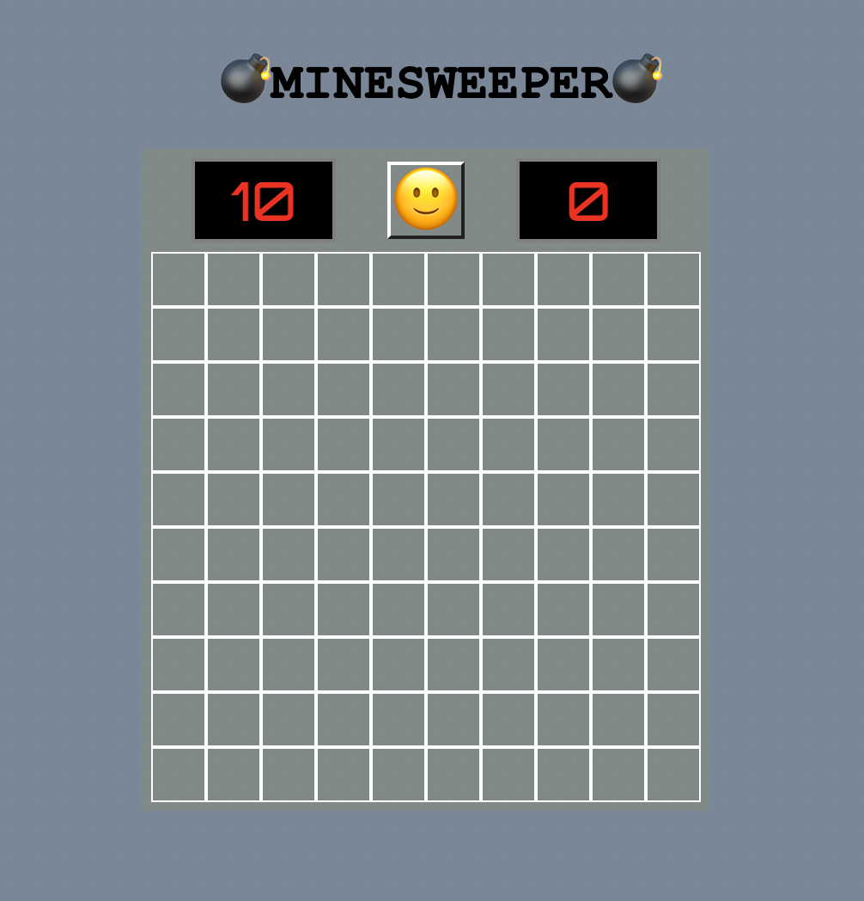
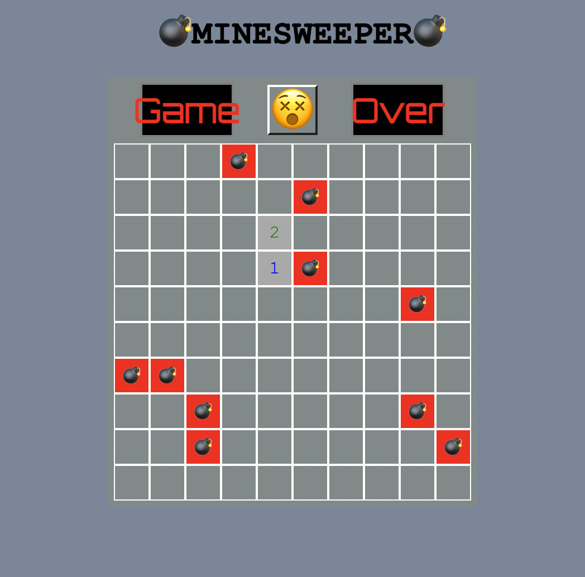
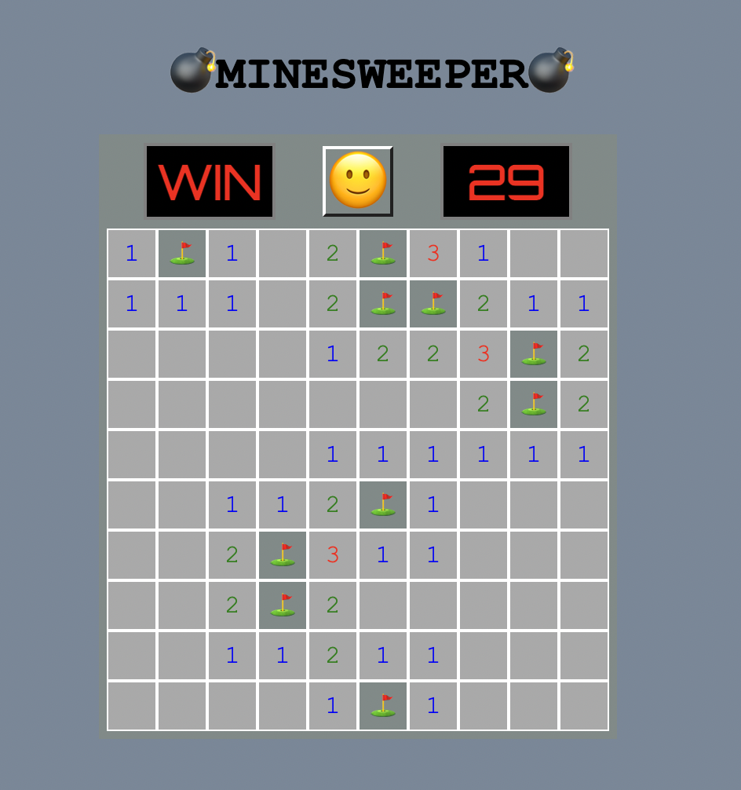

# <Minesweeper!>

The objective of the game is to clear a rectangular board containing hidden mines by clicking on the ones without the mines.

## Screenshots

## Technologies Used

- Figma
- Javascript
- HTML
- CSS

## Getting Started

[Link](https://bbcello.github.io/Minesweeper/)

1. click the link above
2. click any tile to start playing Minesweeper!
3. If you want to restart the game, click on 😵

## Next Steps

- Options to choose difficulties of the game with a main menu
- Disable revealing tiles after game is over.
- More dynamic theme and design
